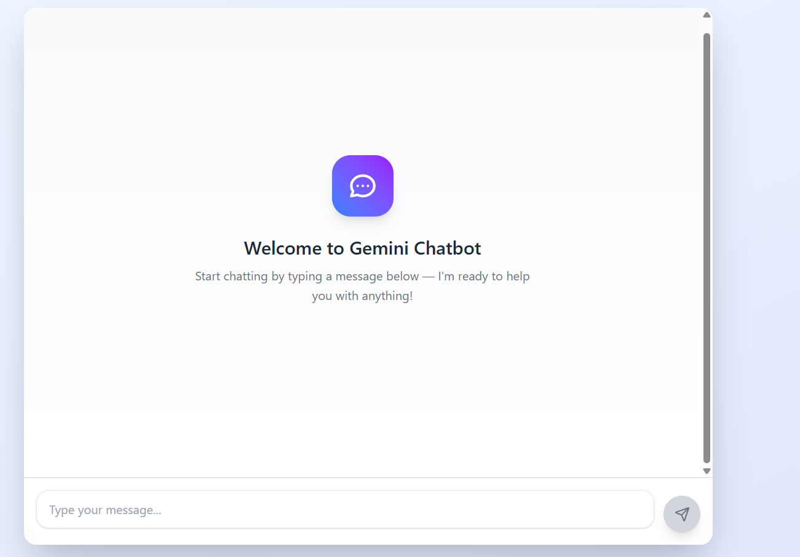

<div align="center">
  <h1>🤖 AI-Powered Chatbot</h1>
  <p>An intelligent chat application built with React + Spring Boot, powered by Google's Gemini AI</p>
  
  [](https://opensource.org/licenses/MIT)
  [](https://www.java.com/)
  [](https://reactjs.org/)
  [](https://spring.io/projects/spring-boot)

  ---
</div>

## 🎉 Features

### 💬 Smart Conversations
- **🤖 AI-Powered Chat**: Engage in natural conversations powered by Google's Gemini AI
- **📱 Responsive Design**: Beautiful UI that works flawlessly on all devices
- **⚡ Blazing Fast**: Built with Vite for lightning-fast development and HMR

### 🛠️ Developer Experience
- **🚀 Modern Stack**: React 19 + Spring Boot 3.5.4
- **🎨 Styled with Tailwind CSS**: Rapid UI development with utility-first CSS
- **🔌 RESTful API**: Clean, well-documented endpoints
- **📦 Easy Setup**: Get up and running in minutes

## 🖥️ Screenshots
<div align="center">

### ✨ Desktop Experience


### 📱 Mobile Optimized


<p>
Experience the same powerful features across all your devices with our fully responsive design that adapts perfectly to any screen size.
</p>

</div>


## 🚀 Tech Stack

### Frontend
| Technology | Description |
|------------|-------------|
| **React 19** | Frontend library for building user interfaces |
| **Vite** | Next-generation frontend tooling |
| **Tailwind CSS** | Utility-first CSS framework |
| **Framer Motion** | For buttery smooth animations |
| **Axios** | Promise-based HTTP client |
| **React Markdown** | Markdown rendering for rich text |

### Backend
| Technology | Description |
|------------|-------------|
| **Java 17** | Modern Java features and performance |
| **Spring Boot 3.5.4** | Rapid application development |
| **Spring AI** | AI integration made simple |
| **Google Gemini** | State-of-the-art AI language model |

## 🛠️ Prerequisites

Before you begin, ensure you have met the following requirements:

- **Node.js** v18 or higher 📦
- **Java 17** or higher ☕
- **Maven** 3.6.3 or higher 🏗️
- **Google Gemini API Key** 🔑

## 🚀 Quick Start

### 1. Clone the Repository
```bash
git clone https://github.com/yourusername/ai-chatbot.git
cd ai-chatbot
```

### 2. Backend Setup

```bash
# Navigate to backend
cd chatbot

# Configure your Gemini API key
echo "gemini.api.key=YOUR_GEMINI_API_KEY" > src/main/resources/application.properties

# Build the project
mvn clean install
```

### 3. Frontend Setup

```bash
# Navigate to frontend
cd ../frontend

# Install dependencies
npm install
```

## 🏃‍♂️ Running the Application

### Start Backend Server
```bash
cd chatbot
mvn spring-boot:run
```
> 🌐 Backend will be available at `http://localhost:8080`

### Start Frontend Development Server
```bash
cd frontend
npm run dev
```
> 💻 Open [http://localhost:5173](http://localhost:5173) in your browser

## 🧩 Project Structure

```
ai-chatbot/
├── chatbot/               # Backend (Spring Boot)
│   ├── src/              # Source code
│   ├── pom.xml           # Maven configuration
│   └── HELP.md           # Backend documentation
│
└── frontend/             # Frontend (React)
    ├── src/              # React components
    ├── public/           # Static assets
    ├── package.json      # NPM configuration
    └── vite.config.js    # Vite configuration
```

## 🤝 Contributing

Contributions are what make the open source community such an amazing place to learn, inspire, and create. Any contributions you make are **greatly appreciated**.

1. Fork the Project
2. Create your Feature Branch (`git checkout -b feature/AmazingFeature`)
3. Commit your Changes (`git commit -m 'Add some AmazingFeature'`)
4. Push to the Branch (`git push origin feature/AmazingFeature`)
5. Open a Pull Request

## 📄 License

Distributed under the MIT License. See `LICENSE` for more information.

## 🙏 Acknowledgments

- [Google Gemini AI](https://ai.google.dev/) for the powerful AI capabilities
- [React](https://reactjs.org/) and [Spring Boot](https://spring.io/projects/spring-boot) teams
- [Vite](https://vitejs.dev/) for the amazing frontend tooling
- [Tailwind CSS](https://tailwindcss.com/) for the utility-first CSS framework

---

<div align="center">
  Made with ❤️ using modern web technologies
</div>

## Project Structure

```
main/
├── chatbot/                     # Backend (Spring Boot)
│   ├── src/
│   │   ├── main/
│   │   │   ├── java/com/chatBot/chatbot/
│   │   │   │   ├── config/     # Configuration classes
│   │   │   │   ├── controller/ # REST controllers
│   │   │   │   ├── dto/        # Data Transfer Objects
│   │   │   │   ├── service/    # Business logic
│   │   │   │   └── ChatbotApplication.java # Main application class
│   │   │   └── resources/
│   │   │       └── application.properties # Configuration
│   └── pom.xml                 # Maven configuration
│
└── frontend/                   # Frontend (React)
    ├── public/                 # Static files
    ├── src/
    │   ├── components/         # React components
    │   ├── App.jsx             # Main application component
    │   └── main.jsx            # Application entry point
    ├── package.json            # NPM dependencies
    └── vite.config.js          # Vite configuration
```

## API Endpoints

### Chat
- **POST** `/api/chat` - Send a message to the chatbot
  - Request body: `{ "prompt": "Your message here" }`
  - Response: `{ "response": "AI response here" }`

## Configuration

### Backend Configuration
- Server port: 8080 (configurable in `application.properties`)
- CORS is configured to allow requests from `http://localhost:5173`

### Frontend Configuration
- Development server: `http://localhost:5173`
- API base URL: `http://localhost:8080/api`

## Contributing

1. Fork the repository
2. Create a feature branch (`git checkout -b feature/AmazingFeature`)
3. Commit your changes (`git commit -m 'Add some AmazingFeature'`)
4. Push to the branch (`git push origin feature/AmazingFeature`)
5. Open a Pull Request

## License

This project is licensed under the MIT License - see the [LICENSE](LICENSE) file for details
